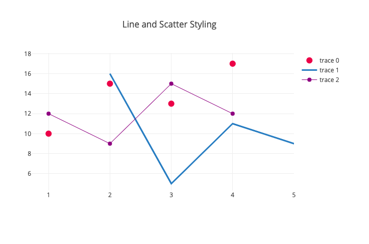
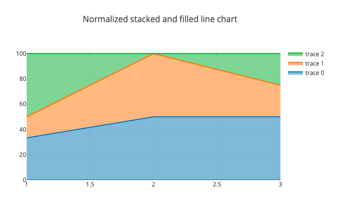

# Kai

Kai is a plotter library for Common Lisp.




## Installation

### Roswell

With [roswell](https://github.com/roswell/roswell), install this repository.

```bash
$ ros install komi1230/kai
```

And setup roswell REPL and load with Quicklisp:

```lisp
(ql:quickload :kai)
```

### ASDF

First, clone this repository and load this:

In terminal:

```bash
$ git clone https://github.com/komi1230/kai
```

And load with ASDF:

```lisp
(asdf:load-system :kai)
```

## How to use

Prepare some data:

```lisp
;; x-axis
(defparameter x
    (loop for i from 0 below 10 by 0.1
          collect i))

;; y-axis
(defparameter y
    (mapcar #'sin x))
```

This example uses List data but Array is also OK.

### Scatter plot

```lisp
(kai:scatter x y)
```

or

```lisp
(kai:scatter y)
```

You can add some options:

```lisp
(kai:scatter y
             :mode "line"   ; "marker", "line" or "marker+line"
             :name "test1")
```

### Style (Not Necessary)

```lisp
(kai:style :title "hogehoge plot")
```

### Show

```lisp
(kai:show)
```
